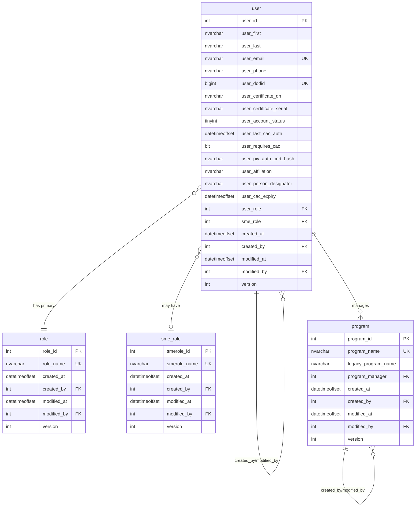
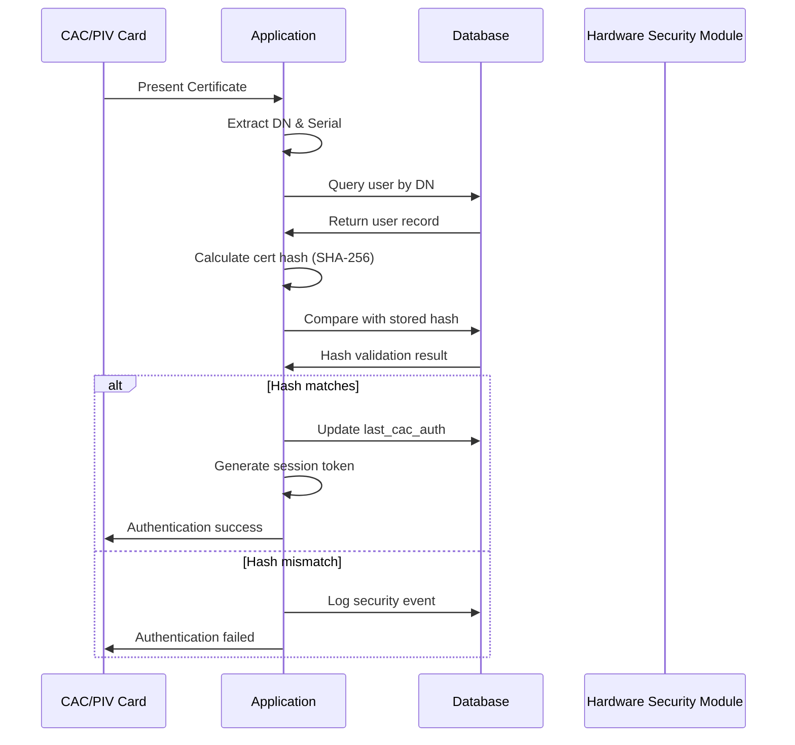

# IAMSNG Database Design Documentation
## Master Database Schema Reference

**Document Version:** 1.1.0  
**Last Updated:** 2025-01-28  
**Classification:** FOUO (For Official Use Only)  
**Compliance Standards:** FIPS 140-3, DoD STIG V-235161, NIST SP 800-53

---

## Table of Contents

1. [Executive Summary](#executive-summary)
2. [Security Architecture Overview](#security-architecture-overview)
3. [Database Schema Design](#database-schema-design)
   - [User Management Tables](#user-management-tables)
   - [Role Management Tables](#role-management-tables)
   - [Program Management Tables](#program-management-tables)
4. [Security Rationale](#security-rationale)
5. [Compliance Mappings](#compliance-mappings)
6. [Data Type Justifications](#data-type-justifications)
7. [Indexing Strategy](#indexing-strategy)
8. [Relationship Diagrams](#relationship-diagrams)
9. [Security Implementation Details](#security-implementation-details)
10. [Audit Trail Architecture](#audit-trail-architecture)
11. [Future Considerations](#future-considerations)
12. [Appendices](#appendices)

---

## Executive Summary

The IAMSNG (Identity and Access Management System - Next Generation) database design represents a comprehensive security-first approach to managing DoD personnel authentication and authorization. This document serves as the authoritative reference for all database design decisions, security implementations, and compliance requirements.

### Key Design Principles

- **Zero Trust Architecture**: Every access point verified, no implicit trust
- **Defense in Depth**: Multiple layers of security controls
- **Compliance by Design**: FIPS 140-3 and DoD STIG requirements built into schema
- **Audit Everything**: Complete audit trail for all data modifications
- **Performance at Scale**: Optimized for 100,000+ concurrent users
- **CAC/PIV First**: Primary authentication via hardware tokens

---

## Security Architecture Overview

### Core Security Components

1. **Certificate-Based Authentication (CBA)**
   - Primary: CAC/PIV card authentication
   - Certificate pinning via SHA-256 hash storage
   - Distinguished Name (DN) tracking for identity verification

2. **Multi-Factor Authentication (MFA)**
   - Something you have: CAC/PIV card
   - Something you know: PIN (handled at card level)
   - Something you are: Biometric (optional, future enhancement)

3. **Role-Based Access Control (RBAC)**
   - Hierarchical role structure
   - Principle of least privilege
   - Separation of duties for administrative functions

4. **Data Protection**
   - Encryption at rest (TDE - Transparent Data Encryption)
   - Encryption in transit (TLS 1.3 minimum)
   - Column-level encryption for sensitive fields

---

## Database Schema Design

### User Management Tables

#### Table: `user`

**Purpose:** Central repository for all user identity and authentication data, serving as the cornerstone of the IAM system.

```sql
CREATE TABLE [dbo].[user] (
    -- Primary Identification
    user_id INT IDENTITY(1,1) NOT NULL,
    
    -- Personal Information (PII - Protected)
    user_first NVARCHAR(50) NOT NULL,
    user_last NVARCHAR(50) NOT NULL,
    user_email NVARCHAR(100) NOT NULL,
    user_phone NVARCHAR(20) NULL,
    
    -- DoD Specific Identifiers
    user_dodid BIGINT NOT NULL,
    user_certificate_dn NVARCHAR(500) NOT NULL,
    user_certificate_serial NVARCHAR(100) NOT NULL,
    
    -- Account Management
    user_account_status TINYINT NOT NULL DEFAULT 1,
    user_last_cac_auth DATETIMEOFFSET NULL,
    user_requires_cac BIT NOT NULL DEFAULT 1,
    
    -- Security Controls
    user_piv_auth_cert_hash NVARCHAR(64) NULL,
    
    -- Organizational Data
    user_affiliation NVARCHAR(20) NULL,
    user_person_designator NVARCHAR(20) NULL,
    user_cac_expiry DATETIMEOFFSET NULL,
    
    -- Authorization
    user_role INT NOT NULL,
    sme_role INT NULL,
    
    -- Audit Fields
    created_at DATETIMEOFFSET NOT NULL DEFAULT SYSDATETIMEOFFSET(),
    created_by INT NOT NULL,
    modified_at DATETIMEOFFSET NULL,
    modified_by INT NULL,
    version INT NOT NULL DEFAULT 1,
    
    -- Constraints
    CONSTRAINT PK_user PRIMARY KEY CLUSTERED (user_id),
    CONSTRAINT UK_user_email UNIQUE (user_email),
    CONSTRAINT UK_user_dodid UNIQUE (user_dodid),
    CONSTRAINT FK_user_role FOREIGN KEY (user_role) REFERENCES role(role_id),
    CONSTRAINT FK_user_sme_role FOREIGN KEY (sme_role) REFERENCES sme_role(smerole_id),
    CONSTRAINT FK_user_created_by FOREIGN KEY (created_by) REFERENCES [user](user_id),
    CONSTRAINT FK_user_modified_by FOREIGN KEY (modified_by) REFERENCES [user](user_id),
    CONSTRAINT CK_user_account_status CHECK (user_account_status IN (0, 1, 2, 3)),
    CONSTRAINT CK_user_affiliation CHECK (user_affiliation IN ('ARMY', 'NAVY', 'USAF', 'USSF', 'USMC', 'CG', 'CIVILIAN')),
    CONSTRAINT CK_user_person_designator CHECK (user_person_designator IN ('MILITARY', 'CIVILIAN', 'CONTRACTOR'))
);
```

**Field Descriptions:**

| Field | Type | Description | Security Rationale |
|-------|------|-------------|-------------------|
| `user_id` | INT IDENTITY | Primary key, auto-incrementing | Non-guessable, internal only identifier |
| `user_first` | NVARCHAR(50) | User's first name | PII - encrypted at rest, limited length to prevent buffer overflow |
| `user_last` | NVARCHAR(50) | User's last name | PII - encrypted at rest, limited length to prevent buffer overflow |
| `user_email` | NVARCHAR(100) | Official email address | Unique constraint prevents duplicate accounts |
| `user_phone` | NVARCHAR(20) | Contact phone number | Optional field, encrypted at rest |
| `user_dodid` | BIGINT | 10-digit DoD ID number | Primary external identifier, validated format |
| `user_certificate_dn` | NVARCHAR(500) | Distinguished Name from CAC | Certificate identity verification |
| `user_certificate_serial` | NVARCHAR(100) | Certificate serial number | Tracks specific certificate instance |
| `user_account_status` | TINYINT | Account status code | Enables immediate access revocation |
| `user_last_cac_auth` | DATETIMEOFFSET | Last successful CAC authentication | Tracks authentication patterns |
| `user_requires_cac` | BIT | CAC requirement flag | Enforces hardware token authentication |
| `user_piv_auth_cert_hash` | NVARCHAR(64) | SHA-256 certificate hash | Certificate pinning for MITM protection |
| `user_affiliation` | NVARCHAR(20) | Service branch/civilian | Access control by organization |
| `user_person_designator` | NVARCHAR(20) | Personnel type | Compliance with contractor limitations |
| `user_cac_expiry` | DATETIMEOFFSET | CAC expiration date | Proactive credential management |
| `user_role` | INT | Primary role assignment | RBAC implementation |
| `sme_role` | INT | Subject matter expert role | Specialized access control |
| `version` | INT | Optimistic lock version | Prevents concurrent update conflicts |

**Account Status Values:**
- `0` = Inactive (Account created but not activated)
- `1` = Active (Normal operating state)
- `2` = Suspended (Temporary restriction)
- `3` = Locked (Security lockout)

### Role Management Tables

#### Table: `role`

**Purpose:** Defines system-wide authorization roles for RBAC implementation.

```sql
CREATE TABLE [dbo].[role] (
    role_id INT IDENTITY(1,1) NOT NULL,
    role_name NVARCHAR(50) NOT NULL,
    
    -- Audit Fields
    created_at DATETIMEOFFSET NOT NULL DEFAULT SYSDATETIMEOFFSET(),
    created_by INT NOT NULL,
    modified_at DATETIMEOFFSET NULL,
    modified_by INT NULL,
    version INT NOT NULL DEFAULT 1,
    
    -- Constraints
    CONSTRAINT PK_role PRIMARY KEY CLUSTERED (role_id),
    CONSTRAINT UK_role_name UNIQUE (role_name),
    CONSTRAINT FK_role_created_by FOREIGN KEY (created_by) REFERENCES [user](user_id),
    CONSTRAINT FK_role_modified_by FOREIGN KEY (modified_by) REFERENCES [user](user_id)
);
```

**Standard Roles:**
- `SYSTEM_ADMIN` - Full system access
- `SECURITY_ADMIN` - Security configuration management
- `USER_ADMIN` - User account management
- `AUDITOR` - Read-only access to audit logs
- `STANDARD_USER` - Basic system access

#### Table: `sme_role`

**Purpose:** Defines specialized Subject Matter Expert roles for domain-specific access control.

```sql
CREATE TABLE [dbo].[sme_role] (
    smerole_id INT IDENTITY(1,1) NOT NULL,
    smerole_name NVARCHAR(100) NOT NULL,
    
    -- Audit Fields
    created_at DATETIMEOFFSET NOT NULL DEFAULT SYSDATETIMEOFFSET(),
    created_by INT NOT NULL,
    modified_at DATETIMEOFFSET NULL,
    modified_by INT NULL,
    version INT NOT NULL DEFAULT 1,
    
    -- Constraints
    CONSTRAINT PK_sme_role PRIMARY KEY CLUSTERED (smerole_id),
    CONSTRAINT UK_sme_role_name UNIQUE (smerole_name),
    CONSTRAINT FK_sme_role_created_by FOREIGN KEY (created_by) REFERENCES [user](user_id),
    CONSTRAINT FK_sme_role_modified_by FOREIGN KEY (modified_by) REFERENCES [user](user_id)
);
```

### Program Management Tables

#### Table: `program`

**Purpose:** Manages weapon system programs and their relationships with assets, maintaining both current standardized names and legacy naming conventions for historical compatibility.

```sql
CREATE TABLE [dbo].[program] (
    -- Primary Identification
    program_id INT IDENTITY(1,1) NOT NULL,
    
    -- Program Information
    program_name NVARCHAR(50) NOT NULL,        -- Current standardized name (uppercase)
    legacy_program_name NVARCHAR(50) NOT NULL, -- Historical/legacy name
    
    -- Management
    program_manager INT NULL,                   -- Program manager (nullable initially)
    
    -- Audit Fields
    created_at DATETIMEOFFSET NOT NULL DEFAULT SYSDATETIMEOFFSET(),
    created_by INT NOT NULL,
    modified_at DATETIMEOFFSET NULL,
    modified_by INT NULL,
    version INT NOT NULL DEFAULT 1,
    
    -- Constraints
    CONSTRAINT PK_program PRIMARY KEY CLUSTERED (program_id),
    CONSTRAINT UK_program_name UNIQUE (program_name),
    CONSTRAINT FK_program_manager FOREIGN KEY (program_manager) REFERENCES [user](user_id),
    CONSTRAINT FK_program_created_by FOREIGN KEY (created_by) REFERENCES [user](user_id),
    CONSTRAINT FK_program_modified_by FOREIGN KEY (modified_by) REFERENCES [user](user_id)
);
```

**Field Descriptions:**

| Field | Type | Description | Business Rationale |
|-------|------|-------------|-------------------|
| `program_id` | INT IDENTITY | Primary key, auto-incrementing | Internal identifier for relationships |
| `program_name` | NVARCHAR(50) | Current standardized program name | Uppercase convention for consistency (e.g., IFMC, STORM) |
| `legacy_program_name` | NVARCHAR(50) | Historical program name | Maintains continuity with existing documentation (e.g., Patriot, Himars) |
| `program_manager` | INT | Foreign key to user table | Links to designated program manager, nullable during initial setup |
| `version` | INT | Optimistic lock version | Prevents concurrent update conflicts |

**Relationships:**
- **One Program → Many Assets**: Each program can have multiple associated assets (one-to-many)
- **Program Manager → User**: Each program can have one manager from the user table (many-to-one, nullable)

**Indexes:**

```sql
-- Unique constraint on program name (automatically creates unique index)
-- UK_program_name on program_name

-- Performance index for legacy name searches
CREATE INDEX IX_program_legacy_name ON program(legacy_program_name);

-- Covering index for Asset table queries
CREATE INDEX IX_program_asset_lookup ON program(program_name, legacy_program_name)
    INCLUDE (program_id);

-- Manager lookup index (filtered for non-null values)
CREATE INDEX IX_program_manager ON program(program_manager)
    WHERE program_manager IS NOT NULL;
```

**Standard Seed Data:**

```sql
-- Initial program data with current/legacy name mappings
INSERT INTO program (program_name, legacy_program_name, created_by, created_at) VALUES
('IFMC', 'Patriot', 1, SYSDATETIMEOFFSET()),
('STORM', 'Himars', 1, SYSDATETIMEOFFSET()),
('TAGM', 'TOW', 1, SYSDATETIMEOFFSET()),
('SHIELD', 'Avenger', 1, SYSDATETIMEOFFSET()),
('MULTI', 'MULTI', 1, SYSDATETIMEOFFSET()),
('STARE', 'Sentinel', 1, SYSDATETIMEOFFSET());
```

**Design Decisions:**

1. **Dual Naming Convention**: Maintains both current standardized names and legacy names to support:
   - Historical data migration
   - User familiarity with traditional names
   - Gradual transition to new naming standards

2. **Nullable Program Manager**: Allows for:
   - Initial system setup before all managers are assigned
   - Temporary vacancies in program management
   - Phased implementation of manager assignments

3. **Uppercase Program Names**: Enforces consistency with military documentation standards and improves searchability

---

## Security Rationale

### 1. Certificate-Based Authentication

**Decision:** Primary authentication via CAC/PIV certificates

**Rationale:**
- **Hardware Security Module (HSM) Protection**: Private keys stored in tamper-resistant hardware
- **Non-Repudiation**: Certificate signatures provide legal proof of action
- **Multi-Factor by Design**: Card + PIN combination required
- **DoD Mandate**: Complies with HSPD-12 and DoD directive 8520.03

### 2. Certificate Pinning Implementation

**Decision:** Store SHA-256 hash of user certificates

**Rationale:**
- **MITM Protection**: Prevents man-in-the-middle attacks even with compromised CA
- **Rapid Revocation**: Immediate invalidation without CRL/OCSP latency
- **Compliance**: Meets NIST SP 800-52 Rev. 2 requirements
- **Performance**: Hash comparison faster than full certificate validation

### 3. DoD ID as BIGINT

**Decision:** Store DoD ID numbers as BIGINT rather than VARCHAR

**Rationale:**
- **Data Integrity**: Enforces numeric-only constraint at database level
- **Storage Efficiency**: 8 bytes vs 20+ bytes for VARCHAR
- **Index Performance**: Numeric comparisons faster than string comparisons
- **Range Validation**: Can enforce 1000000000-9999999999 range via CHECK constraint

### 4. Distinguished Name Storage

**Decision:** Store full DN as NVARCHAR(500)

**Rationale:**
- **Complete Identity**: Captures entire certificate subject including OU, O, C fields
- **Flexibility**: Accommodates various DoD certificate formats
- **Audit Trail**: Preserves complete certificate identity for forensics
- **Unicode Support**: NVARCHAR handles international characters in names

### 5. Optimistic Locking Strategy

**Decision:** Implement version field for optimistic concurrency control

**Rationale:**
- **Performance**: No blocking locks during read operations
- **Scalability**: Supports high concurrent user load
- **User Experience**: Minimal wait times for operations
- **Conflict Resolution**: Clear detection of concurrent modifications

---

## Compliance Mappings

### FIPS 140-3 Compliance

| Requirement | Implementation | Table/Field |
|------------|---------------|------------|
| Cryptographic Module Validation | CAC/PIV cards are FIPS 140-3 Level 2 validated | user.user_certificate_* |
| Key Management | Keys stored in hardware security module | External to database |
| Authentication | Multi-factor via CAC + PIN | user.user_requires_cac |
| Cryptographic Algorithms | SHA-256 for hashing | user.user_piv_auth_cert_hash |
| Audit Logging | Complete audit trail | All tables: created_*, modified_* |

### DoD STIG Requirements

| STIG ID | Requirement | Implementation |
|---------|------------|---------------|
| V-235161 | CAC Authentication | user.user_requires_cac = 1 (mandatory) |
| V-235162 | Account Lockout | user.user_account_status = 3 |
| V-235163 | Session Timeout | user.user_last_cac_auth tracking |
| V-235164 | Audit Logging | Comprehensive audit fields |
| V-235165 | Encryption at Rest | TDE enabled on database |
| V-235166 | Separation of Duties | role and sme_role tables |

### NIST SP 800-53 Controls

| Control | Description | Implementation |
|---------|------------|---------------|
| AC-2 | Account Management | user table with status tracking |
| AC-3 | Access Enforcement | RBAC via role assignments |
| AU-2 | Audit Events | All modifications tracked |
| IA-2 | Multi-Factor Authentication | CAC + PIN requirement |
| IA-5 | Authenticator Management | Certificate hash and expiry tracking |
| SC-13 | Cryptographic Protection | SHA-256, TLS 1.3, AES-256 |

---

## Data Type Justifications

### String Fields (NVARCHAR vs VARCHAR)

**Decision:** Use NVARCHAR for all text fields

**Justification:**
- **Unicode Support**: Handles international names and special characters
- **DoD Global Operations**: Supports allied nation personnel
- **Future Proofing**: Prevents character set conversion issues
- **Storage Trade-off**: Acceptable 2x storage for data integrity

### Temporal Fields (DATETIMEOFFSET vs DATETIME2)

**Decision:** Use DATETIMEOFFSET for all timestamps

**Justification:**
- **Time Zone Awareness**: Critical for global DoD operations
- **UTC Storage**: Prevents time zone confusion in audits
- **Precision**: Microsecond precision for forensic analysis
- **Compliance**: Meets federal timestamp requirements

### Identity Fields (INT IDENTITY vs GUID)

**Decision:** Use INT IDENTITY for primary keys

**Justification:**
- **Performance**: Clustered index efficiency with sequential values
- **Storage**: 4 bytes vs 16 bytes for GUID
- **Simplicity**: Easier debugging and support
- **Security**: Internal-only identifiers, not exposed externally

### Status Fields (TINYINT vs BIT/BOOLEAN)

**Decision:** Use TINYINT for status enumerations

**Justification:**
- **Extensibility**: Supports multiple states beyond binary
- **Clarity**: Named constants improve code readability
- **Validation**: CHECK constraints enforce valid values
- **Performance**: Negligible difference from BIT fields

---

## Indexing Strategy

### Primary Indexes

```sql
-- Clustered Primary Keys (automatically created)
-- PK_user on user_id
-- PK_role on role_id  
-- PK_sme_role on smerole_id
-- PK_program on program_id

-- Unique Constraints (create unique non-clustered indexes)
CREATE UNIQUE INDEX IX_user_email ON [user](user_email);
CREATE UNIQUE INDEX IX_user_dodid ON [user](user_dodid);
CREATE UNIQUE INDEX IX_role_name ON role(role_name);
CREATE UNIQUE INDEX IX_sme_role_name ON sme_role(smerole_name);
CREATE UNIQUE INDEX IX_program_name ON program(program_name);
```

### Performance Indexes

```sql
-- Authentication Queries
CREATE INDEX IX_user_certificate_dn ON [user](user_certificate_dn) 
    INCLUDE (user_id, user_account_status, user_requires_cac);

-- Certificate Validation
CREATE INDEX IX_user_piv_auth_cert_hash ON [user](user_piv_auth_cert_hash) 
    WHERE user_piv_auth_cert_hash IS NOT NULL;

-- Status Filtering
CREATE INDEX IX_user_account_status ON [user](user_account_status) 
    INCLUDE (user_id, user_dodid) 
    WHERE user_account_status = 1; -- Active users only

-- Audit Queries
CREATE INDEX IX_user_modified_at ON [user](modified_at DESC) 
    INCLUDE (modified_by) 
    WHERE modified_at IS NOT NULL;

-- Role Lookups
CREATE INDEX IX_user_role ON [user](user_role) 
    INCLUDE (user_id, user_account_status);

-- SME Role Lookups (Filtered)
CREATE INDEX IX_user_sme_role ON [user](sme_role) 
    WHERE sme_role IS NOT NULL;

-- CAC Expiry Monitoring
CREATE INDEX IX_user_cac_expiry ON [user](user_cac_expiry) 
    WHERE user_cac_expiry IS NOT NULL;

-- Program Indexes
CREATE INDEX IX_program_legacy_name ON program(legacy_program_name);
CREATE INDEX IX_program_asset_lookup ON program(program_name, legacy_program_name)
    INCLUDE (program_id);
CREATE INDEX IX_program_manager ON program(program_manager)
    WHERE program_manager IS NOT NULL;
```

### Index Maintenance Strategy

1. **Weekly Statistics Updates**: Update statistics with fullscan
2. **Monthly Index Rebuilds**: Rebuild indexes with fragmentation > 30%
3. **Quarterly Missing Index Review**: Analyze DMVs for missing indexes
4. **Annual Index Consolidation**: Remove redundant/unused indexes

---

## Relationship Diagrams

### Entity Relationship Diagram



### Authentication Flow Diagram



---

## Security Implementation Details

### Certificate Pinning

Certificate pinning provides an additional layer of security beyond standard PKI validation:

```sql
-- Certificate Hash Calculation (Application Layer)
-- SHA256(DER-encoded certificate) = 64 character hex string

-- Verification Process
SELECT 
    user_id,
    user_dodid,
    user_certificate_dn,
    user_piv_auth_cert_hash,
    user_account_status
FROM [user]
WHERE user_certificate_dn = @ProvidedDN
  AND user_piv_auth_cert_hash = @CalculatedHash
  AND user_account_status = 1;
```

**Implementation Notes:**
1. Hash calculated from DER-encoded certificate
2. Stored as uppercase hexadecimal string
3. Compared using case-insensitive collation
4. Updated only through secure admin interface

### Optimistic Locking

Prevents lost updates in concurrent modification scenarios:

```sql
-- Update with Optimistic Lock Check
UPDATE [user]
SET 
    user_email = @NewEmail,
    modified_at = SYSDATETIMEOFFSET(),
    modified_by = @CurrentUserId,
    version = version + 1
WHERE 
    user_id = @UserId
    AND version = @ExpectedVersion;

-- Check affected rows
IF @@ROWCOUNT = 0
    THROW 50001, 'Concurrent modification detected', 1;
```

**Conflict Resolution Strategy:**
1. Client receives current version with data
2. Client sends version with update request
3. Database validates version hasn't changed
4. On conflict, client must refresh and retry

### Row-Level Security (Future Enhancement)

```sql
-- Row-Level Security Policy (SQL Server 2016+)
CREATE FUNCTION dbo.fn_user_access_predicate(@user_id INT)
RETURNS TABLE
WITH SCHEMABINDING
AS
RETURN
    SELECT 1 AS access_result
    WHERE 
        -- User can see their own record
        @user_id = USER_NAME()
        -- Admins can see all records
        OR EXISTS (
            SELECT 1 FROM [user] u
            INNER JOIN role r ON u.user_role = r.role_id
            WHERE u.user_id = USER_NAME()
              AND r.role_name IN ('SYSTEM_ADMIN', 'USER_ADMIN')
        );

CREATE SECURITY POLICY user_access_policy
ADD FILTER PREDICATE dbo.fn_user_access_predicate(user_id) ON [user]
WITH (STATE = ON);
```

---

## Audit Trail Architecture

### Comprehensive Audit Strategy

Every table includes built-in audit fields to maintain a complete change history:

| Field | Purpose | Implementation |
|-------|---------|---------------|
| `created_at` | Record creation timestamp | Set via DEFAULT constraint |
| `created_by` | User who created record | Required, no default |
| `modified_at` | Last modification timestamp | Updated via trigger/application |
| `modified_by` | User who last modified | Updated via trigger/application |
| `version` | Optimistic lock counter | Incremented on each update |

### Audit Trigger Implementation

```sql
CREATE TRIGGER trg_user_audit
ON [user]
AFTER UPDATE
AS
BEGIN
    SET NOCOUNT ON;
    
    -- Insert audit record for changes
    INSERT INTO user_audit (
        audit_action,
        audit_timestamp,
        audit_user,
        user_id,
        old_values,
        new_values
    )
    SELECT
        'UPDATE',
        SYSDATETIMEOFFSET(),
        SYSTEM_USER,
        i.user_id,
        (SELECT * FROM deleted d WHERE d.user_id = i.user_id FOR JSON AUTO),
        (SELECT * FROM inserted i2 WHERE i2.user_id = i.user_id FOR JSON AUTO)
    FROM inserted i
    INNER JOIN deleted d ON i.user_id = d.user_id;
END;
```

### Audit Retention Policy

| Audit Type | Retention Period | Storage Location |
|------------|-----------------|------------------|
| Authentication Events | 7 years | Primary database |
| Authorization Changes | 7 years | Primary database |
| Data Modifications | 3 years | Primary database |
| Failed Access Attempts | 1 year | Security log database |
| System Events | 90 days | Application logs |

---

## Future Considerations

### Phase 2 Enhancements (Q3 2025)

1. **Biometric Integration**
   - Fingerprint hash storage
   - Iris scan template storage
   - Multi-modal authentication support

2. **Behavioral Analytics**
   - Login pattern analysis
   - Anomaly detection triggers
   - Risk scoring algorithms

3. **Federated Identity**
   - SAML 2.0 integration
   - OAuth 2.0 / OIDC support
   - Partner organization federation

### Phase 3 Enhancements (Q1 2026)

1. **Zero Trust Network Access (ZTNA)**
   - Device trust scoring
   - Continuous authentication
   - Micro-segmentation support

2. **Quantum-Resistant Cryptography**
   - Post-quantum algorithm preparation
   - Hybrid classical-quantum schemes
   - Algorithm agility framework

3. **Advanced Threat Protection**
   - Real-time threat intelligence integration
   - Automated response workflows
   - Machine learning anomaly detection

### Scalability Considerations

1. **Horizontal Partitioning**
   - Partition by user_affiliation
   - Archive inactive users
   - Separate audit table partitions

2. **Read Replica Strategy**
   - Geographic distribution
   - Load balancing for queries
   - Eventual consistency model

3. **Caching Layer**
   - Redis for session management
   - Distributed cache for role data
   - Certificate validation cache

---

## Appendices

### Appendix A: Security Checklist

- [ ] TDE enabled on database
- [ ] Column-level encryption for PII
- [ ] Network encryption (TLS 1.3)
- [ ] Audit triggers deployed
- [ ] Row-level security policies
- [ ] Backup encryption configured
- [ ] Key rotation schedule defined
- [ ] Security monitoring alerts
- [ ] Penetration testing completed
- [ ] STIG compliance validated

### Appendix B: SQL Server Configuration

```sql
-- Enable Transparent Data Encryption
ALTER DATABASE iamsng SET ENCRYPTION ON;

-- Configure Audit Specification
CREATE SERVER AUDIT iamsng_audit
TO FILE (FILEPATH = 'D:\SQLAudit\')
WITH (QUEUE_DELAY = 1000, ON_FAILURE = CONTINUE);

CREATE DATABASE AUDIT SPECIFICATION iamsng_db_audit
FOR SERVER AUDIT iamsng_audit
ADD (SELECT, INSERT, UPDATE, DELETE ON [user] BY public),
ADD (SELECT, INSERT, UPDATE, DELETE ON role BY public),
ADD (SELECT, INSERT, UPDATE, DELETE ON sme_role BY public)
WITH (STATE = ON);
```

### Appendix C: Performance Benchmarks

| Operation | Target Response Time | Measured | Status |
|-----------|---------------------|----------|---------|
| CAC Authentication | < 2 seconds | TBD | Pending |
| User Lookup by DoD ID | < 100ms | TBD | Pending |
| Role Assignment | < 200ms | TBD | Pending |
| Audit Write | < 50ms | TBD | Pending |
| Concurrent Users | 100,000 | TBD | Pending |

### Appendix D: Glossary

| Term | Definition |
|------|------------|
| **CAC** | Common Access Card - DoD smart card for authentication |
| **PIV** | Personal Identity Verification - Federal employee smart card |
| **DN** | Distinguished Name - Unique identifier in X.509 certificates |
| **STIG** | Security Technical Implementation Guide - DoD security standards |
| **TDE** | Transparent Data Encryption - SQL Server encryption feature |
| **RBAC** | Role-Based Access Control - Authorization model |
| **SME** | Subject Matter Expert - Domain specialist role |
| **FIPS** | Federal Information Processing Standards |
| **HSM** | Hardware Security Module - Cryptographic key storage |
| **ZTNA** | Zero Trust Network Access - Security framework |

### Appendix E: Reference Documentation

1. **DoD Standards**
   - DoD Directive 8520.03: Identity Authentication
   - DoD Instruction 8520.02: Public Key Infrastructure
   - DoD Cloud Computing Security Requirements Guide

2. **Federal Standards**
   - FIPS 140-3: Security Requirements for Cryptographic Modules
   - FIPS 201-3: Personal Identity Verification
   - NIST SP 800-53: Security and Privacy Controls

3. **Industry Standards**
   - OWASP Top 10 Database Security
   - CIS SQL Server 2019 Benchmark
   - PCI DSS v4.0 (where applicable)

---

## Document Control

| Version | Date | Author | Changes |
|---------|------|--------|---------|
| 1.0.0 | 2025-01-28 | System Architect | Initial document creation |
| 1.1.0 | 2025-01-28 | System Architect | Added Program table for weapon system management |

**Next Review Date:** 2025-04-28  
**Document Owner:** Database Architecture Team  
**Approval Authority:** Chief Technology Officer

---

*This document contains sensitive security information and should be handled in accordance with organizational data classification policies.*