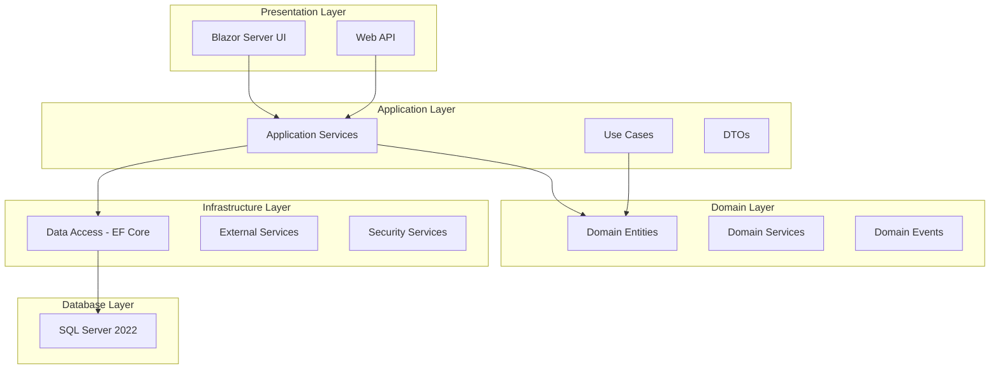

# Technology Stack Documentation

## Executive Summary

The IAMSNG (Industrial Asset Management System - Next Generation) leverages a modern, secure, and scalable technology stack built on Microsoft's .NET 8 LTS platform. This document provides comprehensive documentation of all technologies, frameworks, libraries, and tools used in the system, including their specific versions, purposes, and integration points.

## Table of Contents

1. [Architecture Overview](#architecture-overview)
2. [Core Platform](#core-platform)
3. [Web Technologies](#web-technologies)
4. [Database Technologies](#database-technologies)
5. [Security Technologies](#security-technologies)
6. [Testing Frameworks](#testing-frameworks)
7. [Development Tools](#development-tools)
8. [NuGet Packages](#nuget-packages)
9. [Architecture Patterns](#architecture-patterns)
10. [Infrastructure Technologies](#infrastructure-technologies)
11. [Monitoring and Observability](#monitoring-and-observability)
12. [Integration Technologies](#integration-technologies)

## Architecture Overview



## Core Platform

### .NET 8 Long Term Support (LTS)

**Version:** 8.0.x (Latest LTS)  
**Support Period:** November 2023 - November 2026  
**License:** MIT

#### Key Features Utilized
- **Native AOT Compilation**: For improved startup time and reduced memory footprint
- **Performance Improvements**: ~20% faster than .NET 6
- **Enhanced Security**: Built-in FIPS 140-3 compliance support
- **Improved Containerization**: Smaller container images with distroless support
- **Time Abstraction**: Built-in TimeProvider for testable time-dependent code

#### Platform Configuration
```xml
<Project Sdk="Microsoft.NET.Sdk">
  <PropertyGroup>
    <TargetFramework>net8.0</TargetFramework>
    <LangVersion>12.0</LangVersion>
    <Nullable>enable</Nullable>
    <ImplicitUsings>enable</ImplicitUsings>
    <EnableNETAnalyzers>true</EnableNETAnalyzers>
    <AnalysisLevel>latest</AnalysisLevel>
    <TreatWarningsAsErrors>true</TreatWarningsAsErrors>
    <InvariantGlobalization>false</InvariantGlobalization>
    <PublishAot>false</PublishAot> <!-- Enable for production builds -->
  </PropertyGroup>
</Project>
```

### C# 12.0 Language Features

**Utilized Features:**
- Primary Constructors
- Collection Expressions
- Inline Arrays
- Optional Lambda Parameters
- Alias Any Type
- Interceptors (Preview)

```csharp
// Example of C# 12 features in use
public class Asset(string id, string name) // Primary constructor
{
    public string Id { get; } = id;
    public string Name { get; } = name;
    
    // Collection expression
    private readonly int[] _validStatuses = [1, 2, 3, 4, 5];
    
    // Alias any type
    using SecurityContext = (string UserId, string[] Roles, DateTime LoginTime);
}
```

## Web Technologies

### ASP.NET Core 8.0

**Purpose:** Web application framework  
**Components Used:**
- MVC for API endpoints
- Razor Pages for server-side rendering
- Middleware pipeline for cross-cutting concerns
- Built-in dependency injection
- Configuration management
- Health checks

#### Middleware Pipeline Configuration
```csharp
public class Startup
{
    public void Configure(IApplicationBuilder app)
    {
        app.UseSecurityHeaders();           // Custom security headers
        app.UseHttpsRedirection();           // Force HTTPS
        app.UseHsts();                       // HTTP Strict Transport Security
        app.UseResponseCompression();        // Gzip/Brotli compression
        app.UseStaticFiles();                // Static file serving
        app.UseRouting();                    // Routing middleware
        app.UseCors();                       // CORS policy
        app.UseAuthentication();             // Authentication
        app.UseAuthorization();              // Authorization
        app.UseRateLimiter();               // Rate limiting
        app.UseRequestLogging();            // Custom request logging
        app.UseEndpoints();                 // Map endpoints
    }
}
```

### Blazor Server

**Version:** 8.0  
**Purpose:** Interactive web UI with server-side rendering  
**Rendering Mode:** Interactive Server (SignalR-based)

#### Key Features
- **Real-time UI Updates**: Via SignalR WebSocket connections
- **Component-based Architecture**: Reusable UI components
- **Server-side State Management**: Reduced client-side complexity
- **Built-in Forms and Validation**: Data annotation support
- **JavaScript Interop**: For third-party library integration

#### Component Structure
```csharp
@page "/assets"
@using Microsoft.AspNetCore.Authorization
@attribute [Authorize(Policy = "AssetManager")]
@implements IAsyncDisposable

<PageTitle>Asset Management</PageTitle>

<div class="asset-container">
    @if (IsLoading)
    {
        <LoadingSpinner />
    }
    else
    {
        <AssetGrid Items="@Assets" OnEdit="@HandleEdit" OnDelete="@HandleDelete" />
    }
</div>

@code {
    [Inject] private IAssetService AssetService { get; set; }
    [Inject] private NavigationManager Navigation { get; set; }
    
    private List<Asset> Assets { get; set; } = new();
    private bool IsLoading { get; set; } = true;
    
    protected override async Task OnInitializedAsync()
    {
        await LoadAssetsAsync();
    }
}
```

### SignalR

**Version:** 8.0  
**Purpose:** Real-time web functionality  
**Transport Protocols:** WebSockets (primary), Server-Sent Events, Long Polling (fallback)

#### Hub Configuration
```csharp
public class NotificationHub : Hub<INotificationClient>
{
    public override async Task OnConnectedAsync()
    {
        await Groups.AddToGroupAsync(Context.ConnectionId, Context.User.Identity.Name);
        await base.OnConnectedAsync();
    }
    
    public async Task SendNotification(string message)
    {
        await Clients.Caller.ReceiveNotification(message);
    }
}
```

## Database Technologies

### Microsoft SQL Server 2022 Developer Edition

**Version:** 16.x  
**License:** Free for development/testing  
**Purpose:** Primary relational database

#### Key Features Utilized
- **Temporal Tables**: Built-in system-versioned temporal tables for audit trails
- **Row-Level Security**: Fine-grained access control
- **Always Encrypted**: Column-level encryption with enclave support
- **JSON Support**: Native JSON data type and functions
- **Graph Database**: Node and edge tables for relationship modeling
- **Intelligent Query Processing**: Adaptive query processing

#### Advanced Features Configuration
```sql
-- Enable Query Store for performance monitoring
ALTER DATABASE [IAMSNG] SET QUERY_STORE = ON (
    OPERATION_MODE = READ_WRITE,
    CLEANUP_POLICY = (STALE_QUERY_THRESHOLD_DAYS = 30),
    DATA_FLUSH_INTERVAL_SECONDS = 900,
    MAX_STORAGE_SIZE_MB = 1000,
    INTERVAL_LENGTH_MINUTES = 60
);

-- Configure for high availability
ALTER DATABASE [IAMSNG] SET ACCELERATED_DATABASE_RECOVERY = ON;
ALTER DATABASE [IAMSNG] SET DELAYED_DURABILITY = DISABLED;
```

### Entity Framework Core 8.0

**Version:** 8.0.0  
**Purpose:** Object-Relational Mapping (ORM)

#### Features and Configuration
```csharp
public class ApplicationDbContext : DbContext
{
    protected override void OnConfiguring(DbContextOptionsBuilder optionsBuilder)
    {
        optionsBuilder
            .UseSqlServer(connectionString, options =>
            {
                options.EnableRetryOnFailure(5, TimeSpan.FromSeconds(10), null);
                options.CommandTimeout(30);
                options.UseQuerySplittingBehavior(QuerySplittingBehavior.SplitQuery);
                options.UseNetTopologySuite(); // Spatial data support
            })
            .UseQueryTrackingBehavior(QueryTrackingBehavior.NoTrackingWithIdentityResolution)
            .EnableSensitiveDataLogging(isDevelopment)
            .EnableDetailedErrors(isDevelopment)
            .UseLoggerFactory(loggerFactory)
            .AddInterceptors(new[]
            {
                new AuditingInterceptor(),
                new PerformanceInterceptor(),
                new SoftDeleteInterceptor()
            });
    }
    
    protected override void OnModelCreating(ModelBuilder modelBuilder)
    {
        // Apply configurations from assembly
        modelBuilder.ApplyConfigurationsFromAssembly(Assembly.GetExecutingAssembly());
        
        // Global query filters
        modelBuilder.Entity<BaseEntity>().HasQueryFilter(e => !e.IsDeleted);
        
        // Temporal table configuration
        modelBuilder.Entity<Asset>()
            .ToTable("Assets", t => t.IsTemporal());
    }
}
```

#### EF Core Features Used
- **Migrations**: Code-first database schema management
- **Query Filters**: Global filters for soft delete
- **Shadow Properties**: Audit fields without entity properties
- **Value Converters**: Custom type conversions
- **Compiled Queries**: Performance optimization
- **Bulk Operations**: Efficient bulk insert/update/delete
- **Connection Resiliency**: Automatic retry logic

## Security Technologies

### Authentication & Authorization

#### Windows Authentication
- **Purpose**: Primary authentication for enterprise users
- **Integration**: Active Directory/Domain Controller
- **Protocol**: Kerberos/NTLM

#### Certificate Authentication
- **Purpose**: PKI-based authentication for DoD CAC cards
- **Standard**: X.509 certificates
- **Validation**: Full certificate chain validation with OCSP

#### JWT Bearer Tokens
- **Purpose**: API authentication
- **Algorithm**: RS256 (RSA + SHA256)
- **Token Lifetime**: 15 minutes (access), 7 days (refresh)

### Cryptography

#### FIPS 140-3 Compliant Algorithms
```csharp
public class CryptographyConfiguration
{
    public static readonly Dictionary<string, CryptoAlgorithm> ApprovedAlgorithms = new()
    {
        ["Symmetric"] = new() { Name = "AES", KeySizes = [128, 256] },
        ["Asymmetric"] = new() { Name = "RSA", KeySizes = [2048, 3072, 4096] },
        ["Hash"] = new() { Name = "SHA2", Variants = ["SHA256", "SHA384", "SHA512"] },
        ["KeyDerivation"] = new() { Name = "PBKDF2", Iterations = 100000 },
        ["MAC"] = new() { Name = "HMAC", Variants = ["HMACSHA256", "HMACSHA512"] }
    };
}
```

### Data Protection

**Microsoft.AspNetCore.DataProtection**
- Purpose: Protect sensitive data at rest
- Key Storage: SQL Server with encryption
- Key Rotation: Automatic with 90-day lifetime

## Testing Frameworks

### xUnit v3

**Version:** 3.0.0  
**Purpose:** Unit testing framework  
**License:** Apache 2.0

#### Features Utilized
- **Parallel Test Execution**: Improved test performance
- **Theory Tests**: Data-driven testing
- **Collection Fixtures**: Shared test context
- **Custom Assertions**: Domain-specific assertions
- **Test Output Helpers**: Enhanced debugging

#### Test Configuration
```json
{
  "$schema": "https://xunit.net/schema/v3/xunit.runner.schema.json",
  "parallelAlgorithm": "aggressive",
  "maxParallelThreads": 4,
  "longRunningTestSeconds": 30,
  "diagnosticMessages": true,
  "internalDiagnosticMessages": false,
  "methodDisplay": "method",
  "methodDisplayOptions": "all"
}
```

### Testing Libraries

| Library | Version | Purpose |
|---------|---------|---------|
| **xunit.v3** | 3.0.0 | Core testing framework |
| **xunit.runner.visualstudio** | 3.1.3 | Visual Studio test runner |
| **Microsoft.NET.Test.Sdk** | 17.14.1 | .NET test SDK |
| **Moq** | 4.20.70 | Mocking framework |
| **FluentAssertions** | 6.12.0 | Fluent assertion library |
| **AutoFixture** | 4.18.1 | Test data generation |
| **Bogus** | 35.4.0 | Realistic fake data |
| **WireMock.Net** | 1.5.46 | HTTP API mocking |
| **Respawn** | 6.1.0 | Database test cleanup |
| **TestContainers** | 3.7.0 | Container-based integration testing |

### Test Categories

```csharp
public class TestCategories
{
    public const string Unit = "Unit";
    public const string Integration = "Integration";
    public const string Performance = "Performance";
    public const string Security = "Security";
    public const string EndToEnd = "E2E";
}

[Fact]
[Trait("Category", TestCategories.Unit)]
public async Task Should_Calculate_Asset_Depreciation()
{
    // Test implementation
}
```

## Development Tools

### IDE and Extensions

#### Visual Studio 2022
- **Edition**: Enterprise/Professional
- **Version**: 17.8+
- **Workloads**:
  - ASP.NET and web development
  - .NET desktop development
  - Data storage and processing
  - Azure development

#### Visual Studio Code
- **Extensions**:
  - C# Dev Kit
  - .NET Extension Pack
  - SQL Server (mssql)
  - Docker
  - GitLens
  - REST Client

### Build Tools

#### MSBuild
```xml
<PropertyGroup>
    <Configuration>Release</Configuration>
    <Platform>Any CPU</Platform>
    <OutputPath>bin\$(Configuration)\</OutputPath>
    <DebugType>pdbonly</DebugType>
    <Optimize>true</Optimize>
    <DefineConstants>TRACE</DefineConstants>
</PropertyGroup>
```

#### .NET CLI Tools
```bash
# Global tools installed
dotnet tool install --global dotnet-ef
dotnet tool install --global dotnet-format
dotnet tool install --global dotnet-reportgenerator-globaltool
dotnet tool install --global dotnet-sonarscanner
```

## NuGet Packages

### Core Dependencies

#### iamsng.Web Project
```xml
<ItemGroup>
  <!-- Core Framework -->
  <PackageReference Include="Microsoft.AspNetCore.Components.Web" Version="8.0.0" />
  <PackageReference Include="Microsoft.AspNetCore.SignalR.Client" Version="8.0.0" />
  
  <!-- Security -->
  <PackageReference Include="Microsoft.AspNetCore.Authentication.Negotiate" Version="8.0.0" />
  <PackageReference Include="Microsoft.AspNetCore.Authorization" Version="8.0.0" />
  
  <!-- UI Components -->
  <PackageReference Include="Blazorise" Version="1.4.1" />
  <PackageReference Include="Blazorise.Bootstrap5" Version="1.4.1" />
  <PackageReference Include="Blazorise.Icons.FontAwesome" Version="1.4.1" />
</ItemGroup>
```

#### iamsng.Infrastructure Project
```xml
<ItemGroup>
  <!-- Entity Framework Core -->
  <PackageReference Include="Microsoft.EntityFrameworkCore.SqlServer" Version="8.0.0" />
  <PackageReference Include="Microsoft.EntityFrameworkCore.Tools" Version="8.0.0" />
  <PackageReference Include="Microsoft.EntityFrameworkCore.SqlServer.NetTopologySuite" Version="8.0.0" />
  
  <!-- Security & Compliance -->
  <PackageReference Include="Microsoft.AspNetCore.DataProtection.EntityFrameworkCore" Version="8.0.0" />
  <PackageReference Include="Microsoft.AspNetCore.DataProtection.SqlServer" Version="8.0.0" />
  
  <!-- Configuration -->
  <PackageReference Include="Microsoft.Extensions.Configuration.Abstractions" Version="8.0.0" />
  <PackageReference Include="Microsoft.Extensions.Options.ConfigurationExtensions" Version="8.0.0" />
  
  <!-- Caching -->
  <PackageReference Include="Microsoft.Extensions.Caching.SqlServer" Version="8.0.0" />
  <PackageReference Include="Microsoft.Extensions.Caching.StackExchangeRedis" Version="8.0.0" />
  
  <!-- Logging -->
  <PackageReference Include="Serilog.AspNetCore" Version="8.0.0" />
  <PackageReference Include="Serilog.Sinks.MSSqlServer" Version="6.5.0" />
  <PackageReference Include="Serilog.Enrichers.Environment" Version="2.3.0" />
</ItemGroup>
```

#### iamsng.Application Project
```xml
<ItemGroup>
  <!-- MediatR for CQRS -->
  <PackageReference Include="MediatR" Version="12.2.0" />
  <PackageReference Include="MediatR.Extensions.Microsoft.DependencyInjection" Version="12.2.0" />
  
  <!-- Mapping -->
  <PackageReference Include="AutoMapper" Version="13.0.0" />
  <PackageReference Include="AutoMapper.Extensions.Microsoft.DependencyInjection" Version="13.0.0" />
  
  <!-- Validation -->
  <PackageReference Include="FluentValidation" Version="11.9.0" />
  <PackageReference Include="FluentValidation.DependencyInjectionExtensions" Version="11.9.0" />
  
  <!-- Polly for resilience -->
  <PackageReference Include="Polly" Version="8.2.0" />
  <PackageReference Include="Microsoft.Extensions.Http.Polly" Version="8.0.0" />
</ItemGroup>
```

### Package Purposes

| Package | Purpose | License |
|---------|---------|---------|
| **MediatR** | Implements mediator pattern for CQRS | Apache 2.0 |
| **AutoMapper** | Object-to-object mapping | MIT |
| **FluentValidation** | Strongly-typed validation rules | Apache 2.0 |
| **Polly** | Resilience and transient fault handling | BSD 3-Clause |
| **Serilog** | Structured logging | Apache 2.0 |
| **Blazorise** | Blazor component library | Commercial/MIT |
| **NetTopologySuite** | Spatial data operations | BSD 3-Clause |

## Architecture Patterns

### Clean Architecture

#### Layer Responsibilities

```yaml
Layers:
  Core:
    Purpose: "Business logic and domain models"
    Dependencies: "None"
    Contents:
      - Domain Entities
      - Domain Events
      - Domain Services
      - Repository Interfaces
      - Specifications
    
  Application:
    Purpose: "Application business rules"
    Dependencies: ["Core"]
    Contents:
      - Use Cases (CQRS Commands/Queries)
      - Application Services
      - DTOs
      - Mappers
      - Validators
    
  Infrastructure:
    Purpose: "External concerns"
    Dependencies: ["Core", "Application"]
    Contents:
      - Data Access (EF Core)
      - External Service Clients
      - File System
      - Email/SMS Services
      - Security Implementation
    
  Web/API:
    Purpose: "Presentation layer"
    Dependencies: ["All layers"]
    Contents:
      - Controllers
      - Razor Components
      - View Models
      - API Endpoints
      - SignalR Hubs
```

### Domain-Driven Design (DDD)

#### Tactical Patterns Implemented

```csharp
// Aggregate Root
public class Asset : AggregateRoot
{
    private readonly List<MaintenanceRecord> _maintenanceRecords = new();
    
    public AssetId Id { get; private set; }
    public AssetName Name { get; private set; }
    public AssetStatus Status { get; private set; }
    
    // Domain Events
    public void ScheduleMaintenance(MaintenanceSchedule schedule)
    {
        Guard.Against.Null(schedule, nameof(schedule));
        
        var record = MaintenanceRecord.Create(Id, schedule);
        _maintenanceRecords.Add(record);
        
        AddDomainEvent(new MaintenanceScheduledEvent(Id, record.Id));
    }
}

// Value Object
public class AssetName : ValueObject
{
    public string Value { get; }
    
    public AssetName(string value)
    {
        Guard.Against.NullOrWhiteSpace(value, nameof(value));
        Guard.Against.OutOfRange(value.Length, nameof(value), 1, 100);
        
        Value = value;
    }
    
    protected override IEnumerable<object> GetEqualityComponents()
    {
        yield return Value;
    }
}

// Repository Pattern
public interface IAssetRepository : IRepository<Asset>
{
    Task<Asset> GetByIdAsync(AssetId id);
    Task<IReadOnlyList<Asset>> GetByStatusAsync(AssetStatus status);
    Task<bool> ExistsAsync(AssetId id);
}

// Specification Pattern
public class ActiveAssetsSpecification : Specification<Asset>
{
    public override Expression<Func<Asset, bool>> ToExpression()
    {
        return asset => asset.Status == AssetStatus.Active && 
                       !asset.IsDeleted;
    }
}
```

### CQRS (Command Query Responsibility Segregation)

```csharp
// Command
public class CreateAssetCommand : IRequest<AssetDto>
{
    public string Name { get; set; }
    public string SerialNumber { get; set; }
    public string Category { get; set; }
}

// Command Handler
public class CreateAssetCommandHandler : IRequestHandler<CreateAssetCommand, AssetDto>
{
    private readonly IAssetRepository _repository;
    private readonly IMapper _mapper;
    
    public async Task<AssetDto> Handle(CreateAssetCommand request, CancellationToken cancellationToken)
    {
        var asset = Asset.Create(request.Name, request.SerialNumber, request.Category);
        
        await _repository.AddAsync(asset);
        await _repository.SaveChangesAsync();
        
        return _mapper.Map<AssetDto>(asset);
    }
}

// Query
public class GetAssetByIdQuery : IRequest<AssetDto>
{
    public Guid AssetId { get; set; }
}

// Query Handler
public class GetAssetByIdQueryHandler : IRequestHandler<GetAssetByIdQuery, AssetDto>
{
    private readonly IAssetReadRepository _readRepository;
    
    public async Task<AssetDto> Handle(GetAssetByIdQuery request, CancellationToken cancellationToken)
    {
        return await _readRepository.GetByIdAsync(request.AssetId);
    }
}
```

## Infrastructure Technologies

### Caching

#### Distributed Cache (Redis/SQL Server)
```csharp
public class CacheConfiguration
{
    public static void ConfigureRedisCache(IServiceCollection services, IConfiguration configuration)
    {
        services.AddStackExchangeRedisCache(options =>
        {
            options.Configuration = configuration.GetConnectionString("Redis");
            options.InstanceName = "IAMSNG";
            options.ConfigurationOptions = new ConfigurationOptions
            {
                AbortOnConnectFail = false,
                ConnectRetry = 3,
                ConnectTimeout = 5000,
                SyncTimeout = 5000,
                Password = configuration["Redis:Password"],
                Ssl = true,
                SslProtocols = SslProtocols.Tls12 | SslProtocols.Tls13
            };
        });
    }
}
```

### Message Queue (Azure Service Bus/RabbitMQ)
```csharp
public class MessageQueueConfiguration
{
    public static void ConfigureServiceBus(IServiceCollection services, IConfiguration configuration)
    {
        services.AddMassTransit(x =>
        {
            x.AddConsumers(Assembly.GetExecutingAssembly());
            
            x.UsingAzureServiceBus((context, cfg) =>
            {
                cfg.Host(configuration["ServiceBus:ConnectionString"]);
                
                cfg.ConfigureEndpoints(context);
                
                cfg.UseMessageRetry(r => r.Intervals(100, 200, 500, 800, 1000));
                cfg.UseInMemoryOutbox();
            });
        });
    }
}
```

### Background Jobs (Hangfire)
```csharp
public class BackgroundJobConfiguration
{
    public static void ConfigureHangfire(IServiceCollection services, IConfiguration configuration)
    {
        services.AddHangfire(config =>
        {
            config.UseSqlServerStorage(configuration.GetConnectionString("HangfireConnection"))
                  .UseSimpleAssemblyNameTypeSerializer()
                  .UseRecommendedSerializerSettings()
                  .UseFilter(new AutomaticRetryAttribute { Attempts = 3 })
                  .UseFilter(new DisableConcurrentExecutionAttribute(30));
        });
        
        services.AddHangfireServer(options =>
        {
            options.WorkerCount = Environment.ProcessorCount * 2;
            options.Queues = new[] { "critical", "default", "low" };
        });
    }
}
```

## Monitoring and Observability

### Application Performance Monitoring

#### Application Insights
```csharp
public class TelemetryConfiguration
{
    public static void ConfigureApplicationInsights(IServiceCollection services, IConfiguration configuration)
    {
        services.AddApplicationInsightsTelemetry(options =>
        {
            options.ConnectionString = configuration["ApplicationInsights:ConnectionString"];
            options.EnableAdaptiveSampling = true;
            options.EnableDependencyTrackingTelemetryModule = true;
            options.EnablePerformanceCounterCollectionModule = true;
            options.EnableAppServicesHeartbeatTelemetryModule = true;
        });
        
        services.AddApplicationInsightsTelemetryProcessor<CustomTelemetryProcessor>();
    }
}
```

### Health Checks
```csharp
public class HealthCheckConfiguration
{
    public static void ConfigureHealthChecks(IServiceCollection services, IConfiguration configuration)
    {
        services.AddHealthChecks()
            .AddSqlServer(
                configuration.GetConnectionString("DefaultConnection"),
                name: "database",
                tags: new[] { "critical", "database" })
            .AddRedis(
                configuration.GetConnectionString("Redis"),
                name: "cache",
                tags: new[] { "cache" })
            .AddUrlGroup(
                new Uri(configuration["ExternalServices:AuthService"]),
                name: "auth-service",
                tags: new[] { "external", "auth" })
            .AddCheck<CustomHealthCheck>("custom-check", tags: new[] { "custom" });
        
        services.AddHealthChecksUI()
            .AddInMemoryStorage();
    }
}
```

### Structured Logging (Serilog)
```csharp
public class LoggingConfiguration
{
    public static void ConfigureSerilog(HostBuilderContext context, LoggerConfiguration loggerConfiguration)
    {
        loggerConfiguration
            .ReadFrom.Configuration(context.Configuration)
            .Enrich.FromLogContext()
            .Enrich.WithMachineName()
            .Enrich.WithProcessId()
            .Enrich.WithThreadId()
            .Enrich.WithEnvironmentName()
            .Enrich.WithProperty("Application", "IAMSNG")
            .WriteTo.Console(outputTemplate: "[{Timestamp:HH:mm:ss} {Level:u3}] {Message:lj} {Properties:j}{NewLine}{Exception}")
            .WriteTo.MSSqlServer(
                connectionString: context.Configuration.GetConnectionString("DefaultConnection"),
                sinkOptions: new MSSqlServerSinkOptions
                {
                    TableName = "Logs",
                    SchemaName = "dbo",
                    AutoCreateSqlTable = true
                },
                restrictedToMinimumLevel: LogEventLevel.Information)
            .WriteTo.ApplicationInsights(
                context.Configuration["ApplicationInsights:ConnectionString"],
                TelemetryConverter.Traces,
                restrictedToMinimumLevel: LogEventLevel.Warning);
    }
}
```

## Integration Technologies

### API Documentation (OpenAPI/Swagger)
```csharp
public class SwaggerConfiguration
{
    public static void ConfigureSwagger(IServiceCollection services)
    {
        services.AddOpenApiDocument(config =>
        {
            config.PostProcess = document =>
            {
                document.Info.Version = "v1";
                document.Info.Title = "IAMSNG API";
                document.Info.Description = "Industrial Asset Management System API";
                document.Info.Contact = new OpenApiContact
                {
                    Name = "Support Team",
                    Email = "support@iamsng.mil"
                };
            };
            
            config.AddSecurity("Bearer", Enumerable.Empty<string>(), new OpenApiSecurityScheme
            {
                Type = OpenApiSecuritySchemeType.Http,
                Scheme = "bearer",
                BearerFormat = "JWT",
                Description = "Input your JWT token"
            });
        });
    }
}
```

### GraphQL (HotChocolate)
```csharp
public class GraphQLConfiguration
{
    public static void ConfigureGraphQL(IServiceCollection services)
    {
        services
            .AddGraphQLServer()
            .AddQueryType<Query>()
            .AddMutationType<Mutation>()
            .AddSubscriptionType<Subscription>()
            .AddType<AssetType>()
            .AddFiltering()
            .AddSorting()
            .AddProjections()
            .AddAuthorization()
            .AddDataLoader<AssetDataLoader>()
            .UsePersistedQueryPipeline()
            .AddReadOnlyFileSystemQueryStorage("./persisted_queries");
    }
}
```

### gRPC Services
```csharp
public class GrpcConfiguration
{
    public static void ConfigureGrpc(IServiceCollection services)
    {
        services.AddGrpc(options =>
        {
            options.EnableDetailedErrors = false;
            options.MaxReceiveMessageSize = 4 * 1024 * 1024; // 4MB
            options.MaxSendMessageSize = 4 * 1024 * 1024; // 4MB
            options.Interceptors.Add<ErrorHandlingInterceptor>();
            options.Interceptors.Add<LoggingInterceptor>();
        });
        
        services.AddGrpcReflection();
    }
}
```

## Performance Optimizations

### Response Compression
```csharp
services.AddResponseCompression(options =>
{
    options.EnableForHttps = true;
    options.Providers.Add<BrotliCompressionProvider>();
    options.Providers.Add<GzipCompressionProvider>();
    options.MimeTypes = ResponseCompressionDefaults.MimeTypes.Concat(
        new[] { "application/json", "application/xml", "text/csv" });
});

services.Configure<BrotliCompressionProviderOptions>(options =>
{
    options.Level = CompressionLevel.Optimal;
});
```

### Output Caching
```csharp
services.AddOutputCache(options =>
{
    options.AddBasePolicy(builder => builder.Expire(TimeSpan.FromMinutes(5)));
    
    options.AddPolicy("Assets", builder =>
        builder.Expire(TimeSpan.FromMinutes(10))
               .SetVaryByQuery("page", "pageSize", "sortBy")
               .Tag("assets"));
    
    options.AddPolicy("Static", builder =>
        builder.Expire(TimeSpan.FromHours(24)));
});
```

## Development Workflow Tools

### Git Configuration
```gitignore
# Build results
[Dd]ebug/
[Rr]elease/
[Bb]in/
[Oo]bj/

# User-specific files
*.user
*.userosscache
*.sln.docstates

# Visual Studio
.vs/
*.suo
*.ntvs*
*.njsproj
*.sln.ide

# .NET Core
project.lock.json
project.fragment.lock.json
artifacts/

# Sensitive files
*.pfx
*.snk
appsettings.Production.json
secrets.json
```

### CI/CD Pipeline (Azure DevOps)
```yaml
trigger:
  branches:
    include:
    - main
    - develop
    - release/*

pool:
  vmImage: 'windows-latest'

variables:
  buildConfiguration: 'Release'
  dotnetVersion: '8.x'

stages:
- stage: Build
  jobs:
  - job: BuildJob
    steps:
    - task: UseDotNet@2
      inputs:
        version: $(dotnetVersion)
    
    - task: DotNetCoreCLI@2
      displayName: 'Restore'
      inputs:
        command: restore
        projects: '**/*.csproj'
    
    - task: DotNetCoreCLI@2
      displayName: 'Build'
      inputs:
        command: build
        projects: '**/*.csproj'
        arguments: '--configuration $(buildConfiguration)'
    
    - task: DotNetCoreCLI@2
      displayName: 'Test'
      inputs:
        command: test
        projects: '**/*Tests.csproj'
        arguments: '--configuration $(buildConfiguration) --collect:"XPlat Code Coverage"'
    
    - task: PublishCodeCoverageResults@1
      inputs:
        codeCoverageTool: 'Cobertura'
        summaryFileLocation: '$(Agent.TempDirectory)/**/coverage.cobertura.xml'
```

## Version Management

### Package Version Strategy
```xml
<PropertyGroup>
  <!-- Central Package Management -->
  <ManagePackageVersionsCentrally>true</ManagePackageVersionsCentrally>
  
  <!-- Version Properties -->
  <MicrosoftAspNetCoreVersion>8.0.0</MicrosoftAspNetCoreVersion>
  <MicrosoftEntityFrameworkCoreVersion>8.0.0</MicrosoftEntityFrameworkCoreVersion>
  <MicrosoftExtensionsVersion>8.0.0</MicrosoftExtensionsVersion>
</PropertyGroup>

<ItemGroup>
  <!-- Central versions defined in Directory.Packages.props -->
  <PackageVersion Include="Microsoft.AspNetCore.Components.Web" Version="$(MicrosoftAspNetCoreVersion)" />
  <PackageVersion Include="Microsoft.EntityFrameworkCore.SqlServer" Version="$(MicrosoftEntityFrameworkCoreVersion)" />
</ItemGroup>
```

## Technology Roadmap

### Planned Upgrades
| Technology | Current Version | Target Version | Timeline |
|-----------|----------------|----------------|----------|
| .NET | 8.0 LTS | 9.0 | Q4 2024 |
| SQL Server | 2022 | 2022 SP1 | Q2 2024 |
| xUnit | 3.0.0 | 3.1.0 | Q2 2024 |
| Entity Framework Core | 8.0.0 | 8.1.0 | Q3 2024 |

### Future Technology Considerations
- **Container Orchestration**: Kubernetes deployment
- **Service Mesh**: Istio for microservices communication
- **Event Streaming**: Apache Kafka for event sourcing
- **Time Series Database**: InfluxDB for metrics
- **Machine Learning**: ML.NET for predictive maintenance

## Appendices

### Appendix A: Complete NuGet Package List
[Detailed list of all NuGet packages with exact versions and licenses]

### Appendix B: Configuration Files
[Sample configuration files for all environments]

### Appendix C: Performance Benchmarks
[Benchmark results for critical operations]

### Appendix D: Security Compliance Matrix
[Mapping of technologies to security requirements]